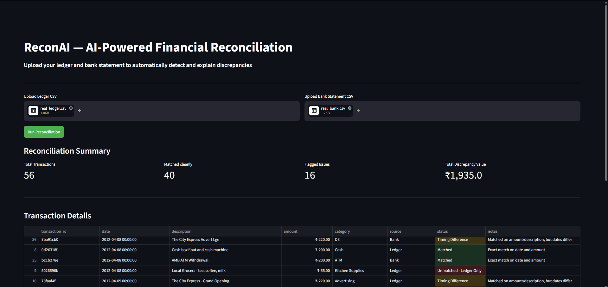

# ReconAI — AI-Powered Financial Reconciliation

An AI-powered web application that automates bank and internal ledger reconciliation using Python, Pandas, and Gemini AI.

## Problem Statement

Manual reconciliation between internal company ledgers and bank statements is typically slow, repetitive, and highly error-prone. Finance teams often spend hours tracking down minor discrepancies like timing differences, typos, and unrecorded fees. ReconAI automates the tedious matching process and leverages AI to intelligently summarize discrepancies, reducing hours of work to mere seconds.

## Features

- **Automated Matching:** Exact and fuzzy matching logic to automatically reconcile transactions based on date, amount, and descriptions.
- **Categorization:** Automatically categorizes discrepancies into clear categories: Timing Differences, Amount Mismatches, Unmatched items, and Possible Duplicates.
- **AI Summary Generation:** Uses Google's Gemini 2.0 Flash AI to generate a professional, plain-English summary of discrepancies, offering actionable next steps for the finance team.
- **Demo Ready:** Includes a sample data generator to instantly demo the app's capabilities with realistic business data.

## Tech Stack

- **Backend / Matching Logic:** Python 3.11+, Pandas
- **Frontend UI:** Streamlit
- **AI Integration:** Google Generative AI (Gemini 2.0 Flash API)

## How to run locally

### 1. Clone the repository and navigate to the project directory
```bash
git clone <repository_url>
cd recon-ai
```

### 2. Set up a virtual environment (optional but recommended)
```bash
python -m venv venv
# Windows:
venv\Scripts\activate
# Mac/Linux:
source venv/bin/activate
```

### 3. Install dependencies
```bash
pip install -r requirements.txt
```

### 4. Setup environment variables
Copy the `.env.example` file to a new file named `.env` and add your Gemini API key:
```bash
cp .env.example .env
# Edit .env and replace your_api_key_here with your actual Gemini API key
```

### 5. Generate sample data (Optional)
This will generate two CSV files in the `data/` directory with intentional mismatches for testing.
```bash
python generate_sample_data.py
```

### 6. Run the application
```bash
streamlit run app.py
```

## Screenshot Placeholder


## Sample Output
The tool will automatically categorize transactions, such as catching:
- A $25 bank service fee missing from the ledger
- A timing difference where a check cleared two days late
- A data entry typo of $105.00 instead of $150.00
- Duplicate entries in the ledger for the same transaction

## Future Improvements

- Support for multi-currency reconciliation and exchange rate fluctuations.
- Direct bank API integrations (e.g., Plaid) for real-time bank statement fetching.
- User authentication and multi-tenant support for multiple businesses.
